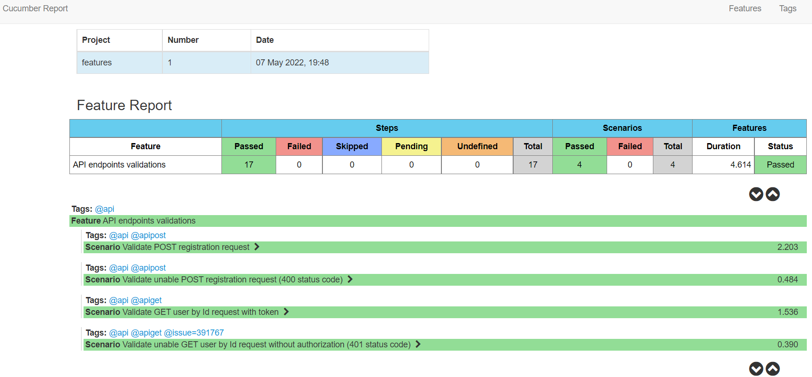
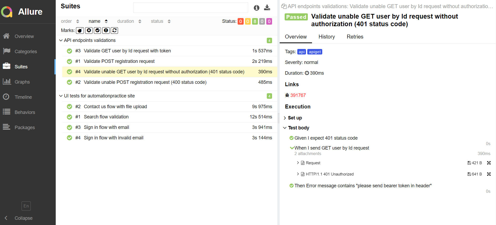

## Cucumber Test Framework

Test framework consists of 2 modules:
1. `features` - files with test cases (in BDD style)
2. `framework` - infrastructure with api models & requests, ui pages, etc.

Command to build 'framework' (execute in /framework directory):

> mvn clean install

Command to run tests in 'features' (execute in /features directory)

> mvn clean post-integration-test

*&ast;groups of tests could be started by tags, ex.:*

> mvn clean post-integration-test -Dtest.tag=@api

### Demo Test Reports

Framework generates 2 different reports by default (available in /demo-reports directory):
- [Cucumber report](./demo-reports/cucumber-html-reports/overview-features.html)
  

- [Allure report](./demo-reports/allure-report/index.html)
  

### Bug report integration

Framework has an integration (linking from allure report via @issue annotations) with free open-source bug report system
[bugasura.io](https://my.bugasura.io) 

