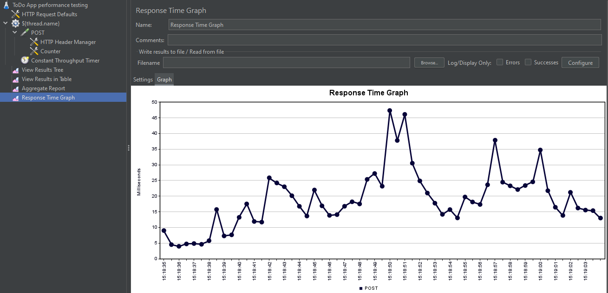

## Cucumber Test Framework

Test framework consists of 2 modules:
1. `features` - files with test cases (in BDD style)
2. `framework` - infrastructure with api models & requests, ui pages, etc.

Command to build 'framework' (execute in /framework directory):

> mvn clean install

Command to run tests in 'features' (execute in /features directory)

> mvn clean post-integration-test

*&ast;groups of tests could be started by tags, ex.:*

> mvn clean post-integration-test -Dtest.tag=@api

### Demo Test Reports

Framework generates 2 different reports by default (available in /demo-reports directory):
- [Cucumber report](./demo-reports/cucumber-html-reports/overview-features.html)
  

- [Allure report](./demo-reports/allure-report/index.html)
  

### Bug report integration

Framework has an integration (linking from allure report via @issue annotations) with free open-source bug report system
[bugasura.io](https://my.bugasura.io) 


### Performance testing

Under directory *performance* exists `*.jmx` files, which are used by Jmeter tool to provide load testing.

**Example: ToDo App Load testing Profile:**

```
Base URL = http://localhost:8088
Threads = 10
RampUp = 10s
Looping = Infinite (test will stop by time)
Duration = 30s
Request Per Minute (RPM) = 6000 
(equal requested 100 todos create in 1sec)
```

**ToDo App Load testing Results:**

According picture with 'Response Time Graph' average response time increased from ~5ms to ~25ms.
This happens due to multiple requests in short period of time and limitations of service responsibility.

But according 'Aggregate Report' no Errors occur (0.00%) and 90%Line is 32ms - for local run it's quite positive result.
For modern systems good avg. response time for internal requests is 10th milliseconds,
for external requests 100th milliseconds.

**Load testing Execution:**
1. via Jmeter tool
   

2. via command line (as command of maven plugin) - in progress


